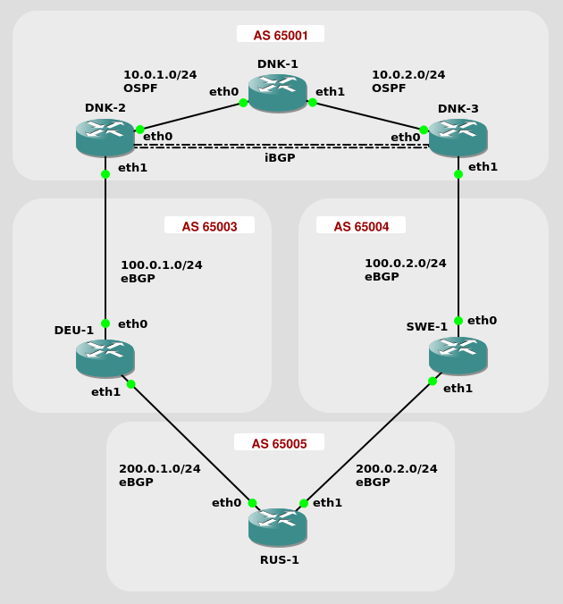
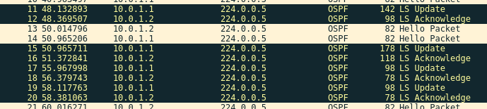

# Workshop 5

## Dynamic Routing Part II

## Part 1: Dynamic routing with BGP

This workshop is dedicated to the OPSF (Open Shortest Path First) and BGP (Border Gateway Protocol) dynamic routing protocol. OPSF is a link state routing protocol used to maintain routing within an autonomous system. In contrast, BGP is mainly used by service providers to perform the routing between autonomous systems in the Internet.

### Lab Overview

In this workshop will be looking at the network scenario sketched below:

#### Topology



#### AS Overview

* AS 65001
  * DNK-1
  * DNK-2
  * DNK-3
* AS 65003
  * DEU-1
* AS 65004
  * SWE-1
* AS 65005
  * RUS-1

#### Routing Protocols

* OSPF Mesh
  * DNK-1
  * DNK-2
  * DNK-3
* eBGP
  * DNK-2 <-> DEU-1
  * DEU-1 <-> RUS-1
  * RUS-1 <-> SWE-1
  * SWE-1 <-> DNK-3
* iBGP
  * DNK-2 <-> DNK-3

The functionalities we will test in this workshop are the following:

DNK-2 is the preferred router to exit AS 65001. Customized local preferences are applied through route maps to the BGP incoming routes on DNK-2 (333) and DNK-3 (222).

* eBGP (External BGP): BGP between the autonomous systems.
* iBGP (Internal BGP): BGP inside an AS.
* BGP to OSPF redistribution:
    * On DNK-2: BGP routes are injected into OSPF with a metric of 1000.
    * On DNK-3: BGP routes are injected into OSPF with a metric of 2000.
* OSPF to BGP redistribution:
    * On DNK-2: OSPF networks are injected into BGP with the default values.
    * On DNK-3: OSPF networks are injected into BGP with the default values.


### Preparation

> ##### Challenge 5.1
> Make an adressing plan for the network:
>
> | AS #     | Node ID | eth0 (IP address / netmask) | eth1 (IP address / netmask) | lo (Loop back addr./32) |
> |----------|---------|-----------------------------|-----------------------------|-------------------------|
> | AS 65001 | DNK-1	 | 10.0.1.1/24                 | 10.0.2.1/24                 | 20.0.1.1/32             |
> | AS 65001 | DNK-2	 | 10.0.1.2/24                 | 100.0.1.1/24                | 30.0.1.1/32             |
> | AS 65001 | DNK-3	 | 10.0.2.2/24                 | 100.0.2.1/24                | 40.0.1.1/32             |
> | AS 65003 | DEU-1	 | 100.0.1.2/24                | 200.0.1.1/24                | 50.0.1.1/32             |
> | AS 65004 | SWE-1	 | 100.0.2.2/24                | 200.0.2.1/24                | 60.0.1.1/32             |
> | AS 65005 | RUS-1	 | 200.0.1.2/24                | 200.0.2.2/24                | 70.0.1.1/32             |
>

### Configuration the Interfaces

To enter configure mode use following command

```
configure terminal
```

Interfaces should be configured like this

```
interface eth0
  ip address 10.0.1.1/24
  link-detect
```

where you use interfaces and adresses according to your plan. The link-detect Flag enable network interface drivers support reporting link-state via the IFF RUNNING flag.

Proceed to the other routers and all relevant interfaces.

### Configuring OSPF

The OSPF routers are configured like this:

```
! DNK-1
router ospf
  redistribute connected
  network 10.0.1.0/24 area 0.0.0.0
  network 10.0.2.0/24 area 0.0.0.0
```

```
! DNK-2
router ospf
  network 30.0.1.1/32 area 0.0.0.0
  network 10.0.1.0/24 area 0.0.0.0
```


Proceed to the other OSPF routers and complete the configurations.

### Inspecting the OSPF Network

* Start a Wireshark capture on DNK-1 eth0

> ##### Challenge 5.2
> Inspect an OSPF Hello messages. What is the Hello time interval used? What is the destination address used and what does it mean?
> ```
> The hello packets have a time interval of 10 seconds. The destination address is 224.0.0.5 which is an OSPF multicast address used to 
> send hello packets. 
>
>
>
>
> ```

* Start a Wireshark capture on DNK-1 eth0
* Stop and Start DNK-3

> ##### Challenge 5.3
> Inspect and explain the OSPF messages by using Wireshark. What are the main observations for the message exchange?
> ```
> When DNK-3 is started again there are several packets:
> LS Updates and LS Acknowledgement
> They are repeatet 4 times 
> The routers are exchanging their link state and metrics.
>
>
> ```




Check: Did you see the OSPF messages: DB Descr., LS Request, LS Update, LS Acknowledgement in addition to the Hello messages? If not check your configuration again.

> ##### Challenge 5.4
> Extract the routing table on DNK-1 using the command ```show ip route```. Explain the entries in the routing table:
> ```
> DNK-1# show ip route
> Codes: K - kernel route, C - connected, S - static, R - RIP,
>      O - OSPF, I - IS-IS, B - BGP, P - PIM, A - Babel,
>      > - selected route, * - FIB route
>
> O   10.0.1.0/24 [110/10] is directly connected, eth0, 00:27:57
> C>* 10.0.1.0/24 is directly connected, eth0
> O   10.0.2.0/24 [110/10] is directly connected, eth1, 00:28:41
> C>* 10.0.2.0/24 is directly connected, eth1
> C>* 20.0.1.1/32 is directly connected, lo
> C>* 127.0.0.0/8 is directly connected, lo
>
> Here we can see that router DNK-1 is directly connected to the two networks.
> The O indicate that we are connect via OSPF
> The C>* stands for connected selected route and it is the routing information.
>
> ```

Check: Do you find the loop-back addressed of DNK-2 and DNK-3 in the routing table. If not check your configuration again.

### Configuring BGP

Now you should add the BGP configuration to the 5 BGP routers

Between the eBGP nodes we use the ip on the interface. Between the iBGP nodes we use the loopback address

```
! DNK-2
router bgp 65001
  bgp router-id 30.0.1.1
  network 30.0.1.1 mask 255.255.255.255
  redistribute connected
  neighbor 40.0.1.1 remote-as 65001
  neighbor 40.0.1.1 update-source lo
  neighbor 172.16.1.2 remote-as 65003
  no auto-summary
```

```
! RUS-2
router bgp 65005
  bgp router-id 70.0.1.1
  redistribute connected
  neighbor 192.168.1.1 remote-as 65003
  neighbor 192.168.2.1 remote-as 65004  
  no auto-summary
```


### Inspecting the BGP Network

> ##### Challenge 5.5
> Look at the route table in DNK-1, DNK-2 and RUS-1. Can everybody reach everybody? Why / Why not?
> ```
> From DNK-1 we can only reach DNK-2 and 3. 
> From DNK-2 we can reach all around the network.
> From RUS-1 we can reach reach everybody but not DNK-1's loopback. 
> DNK-1 Does not participate in BGP only OSPF and we have yet to setup the redistribution so DNK-1
> does not reach outside of AS65001 form DNK-1
>
> ```

### Redistribute OSPF and BGP

Start by redistributing the BGP routes into the ospf by adding following lines to DNK-2 and DNK-3 (Remember they have differnet metrics)

```
router ospf
  redistribute bgp metric 2000
```

Now look at DNK-1's route table. You should be able to see 70.0.1.1. But if you look in RUS-1's route table, you should not see 20.0.1.1. Lets fix that by adding the OSPF routes to BGP

```
router bgp 65001
  redistribute ospf
  neighbor 172.16.1.2 route-map deu1 in
route-map deu1 permit 10
    set local-preference 222
```
> ##### Challenge 5.6
> Extract the routing table on DNK-2 (or DNK-3). Explaning the entries in the routing table:
> ```
> DNK-2# show ip route
> Codes: K - kernel route, C - connected, S - static, R - RIP,
>        O - OSPF, I - IS-IS, B - BGP, P - PIM, A - Babel,
>        > - selected route, * - FIB route
> 
> O   10.0.1.0/24 [110/10] is directly connected, eth0, 01:03:22
> C>* 10.0.1.0/24 is directly connected, eth0
> B>* 10.0.2.0/24 [20/0] via 100.0.1.2, eth1, 00:14:38
> O   10.0.2.0/24 [110/20] via 10.0.1.1, eth0, 01:02:27
> O>* 20.0.1.1/32 [110/20] via 10.0.1.1, eth0, 01:02:26
> C>* 30.0.1.1/32 is directly connected, lo
> O   50.0.1.1/32 [110/2000] via 10.0.1.1, eth0, 00:08:58
> B>* 50.0.1.1/32 [20/0] via 100.0.1.2, eth1, 00:14:38
> O   60.0.1.1/32 [110/2000] via 10.0.1.1, eth0, 00:08:58
> B>* 60.0.1.1/32 [20/0] via 100.0.1.2, eth1, 00:13:08
> O   70.0.1.1/32 [110/2000] via 10.0.1.1, eth0, 00:08:58
> B>* 70.0.1.1/32 [20/0] via 100.0.1.2, eth1, 00:13:38
> O   100.0.1.0/24 [110/2000] via 10.0.1.1, eth0, 00:08:58
> C>* 100.0.1.0/24 is directly connected, eth1
> B>* 100.0.2.0/24 [20/0] via 100.0.1.2, eth1, 00:13:08
> C>* 127.0.0.0/8 is directly connected, lo
> O   200.0.1.0/24 [110/2000] via 10.0.1.1, eth0, 00:08:58
> B>* 200.0.1.0/24 [20/0] via 100.0.1.2, eth1, 00:14:38
> O   200.0.2.0/24 [110/2000] via 10.0.1.1, eth0, 00:08:58
> B>* 200.0.2.0/24 [20/0] via 100.0.1.2, eth1, 00:13:38
>
> Some of the symbols are the same as OSPF and are explained above. 
> The B symbol represents a BGP connection. 
> ```

> ##### Challenge 5.7
> Go back to Wireshark and see if you can find BGP protocol message. Explain your findings?
> ```
> BGP sends alot of messages: Open, Keepalive and update where observed, the routers are clearly 
> telling that they are still on the network and exchanging routing information.
> ```

> ##### Challenge 5.8
> Now you should be able to ping router RUS-1 from router DNK-1. Use tracepath to determine the path traffic takes from RUS-1 to DNK-1. Note the path.
> ```
> We could ping but traceroute does not work. Maybe the packets are using diffrent routes to return?
>
> ```

> ##### Challenge 5.9
> Use tracepath to determine the path traffic takes from DNK-2 to DNK-3. Note the path and explain why?
> ```
> tracepath shows that form DNK-2 we take DNK-1 to get to DNK-3
>
> ```

### Fail-over scenario

Node failure

To simulate a node failure in VNE we can choose to kill the UML instance from the Linux host OS. This is achieved by e.g.
sudo kill -s STOP $(cat .uml/uml3/pid)
where the number is chosen to address the specific UML node. The node can be restarted by the command:
sudo kill -s CONT $(cat .uml/uml3/pid)
Alternatively, you can stop an UML node but still have the interfaces up an running with the command sudo uml_mconsole uml3 stop. By using the go command you can restart the node.

    Store a copy of the routing table of DNK-1.

> ##### Challenge 5.10
> Now let the node DNK-2 on the path from DNK-1 to RUS-1 fail. Check that the path for RUS-1 to DNK-1 changes. Explain what happens (i.e. what are the main differences observed?)
> ```
> DNK-1# show ip route
> Codes: K - kernel route, C - connected, S - static, R - RIP,
>        O - OSPF, I - IS-IS, B - BGP, P - PIM, A - Babel,
>        > - selected route, * - FIB route
> O   10.0.1.0/24 [110/10] is directly connected, eth0, 00:04:00
> C>* 10.0.1.0/24 is directly connected, eth0
> O   10.0.2.0/24 [110/10] is directly connected, eth1, 00:04:01
> C>* 10.0.2.0/24 is directly connected, eth1
> C>* 20.0.1.1/32 is directly connected, lo
> O>* 30.0.1.1/32 [110/20] via 10.0.1.2, eth0, 00:03:55
> O>* 40.0.1.1/32 [110/20] via 10.0.2.2, eth1, 00:03:56
> O>* 50.0.1.1/32 [110/1000] via 10.0.1.2, eth0, 00:03:54
> O>* 60.0.1.1/32 [110/1000] via 10.0.1.2, eth0, 00:03:54
> O>* 70.0.1.1/32 [110/1000] via 10.0.1.2, eth0, 00:03:54
> O>* 100.0.1.0/24 [110/2000] via 10.0.2.2, eth1, 00:03:48
> O>* 100.0.2.0/24 [110/1000] via 10.0.1.2, eth0, 00:03:54
> C>* 127.0.0.0/8 is directly connected, lo
> O>* 200.0.1.0/24 [110/1000] via 10.0.1.2, eth0, 00:03:54
> O>* 200.0.2.0/24 [110/1000] via 10.0.1.2, eth0, 00:03:54
> ```

> ##### Challenge 5.11
> Now extract the routing table of DNK-1 again. Compare with the copy you stored before the fail-over. What are the main differences?
> ```
> DNK-1# show ip route
> Codes: K - kernel route, C - connected, S - static, R - RIP,
>        O - OSPF, I - IS-IS, B - BGP, P - PIM, A - Babel,
>        > - selected route, * - FIB route
> O   10.0.1.0/24 [110/10] is directly connected, eth0, 00:04:54
> C>* 10.0.1.0/24 is directly connected, eth0
> O   10.0.2.0/24 [110/10] is directly connected, eth1, 00:04:55
> C>* 10.0.2.0/24 is directly connected, eth1
> C>* 20.0.1.1/32 is directly connected, lo
> O>* 40.0.1.1/32 [110/20] via 10.0.2.2, eth1, 00:04:50
> O>* 50.0.1.1/32 [110/2000] via 10.0.2.2, eth1, 00:00:08
> O>* 60.0.1.1/32 [110/2000] via 10.0.2.2, eth1, 00:00:08
> O>* 70.0.1.1/32 [110/2000] via 10.0.2.2, eth1, 00:00:08
> O>* 100.0.1.0/24 [110/2000] via 10.0.2.2, eth1, 00:00:33
> C>* 127.0.0.0/8 is directly connected, lo
> O>* 200.0.1.0/24 [110/2000] via 10.0.2.2, eth1, 00:00:08
> O>* 200.0.2.0/24 [110/2000] via 10.0.2.2, eth1, 00:00:08
> 
> When DNK-2 was killed, DNK-1 routing table was changed to go through DNK-2 instead. 
>
> ```